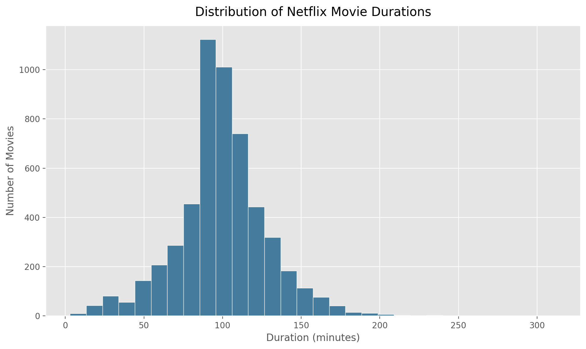

# Investigating Netflix Movies

This project explores Netflix movie data through a notebook-first exploratory data analysis workflow. The analysis goes beyond a single visualization and looks at data completeness, title mix, release trends, runtime distributions, genre patterns, country patterns, and a focused 1990s slice.

## Main Notebook

- `Investigating_Netflix_Movies.ipynb`

This notebook is the main project artifact and brings the code, findings, and visuals together in one place for GitHub review.

## EDA Focus

- 7,787 total Netflix titles in the dataset
- 5,377 movie entries used for the movie-focused analysis
- Average movie duration: 99.31 minutes
- 194 movies released in the 1990s
- Dramas, Comedies, and Documentaries appear most often among movie titles

## Questions Explored

- What does the movie catalog look like before filtering?
- How complete is the data?
- Are Netflix movie durations getting shorter over time?
- What does the duration distribution look like?
- Which genres appear most often in the movie catalog?
- Which countries contribute the most movie titles?
- What stands out about movies from the 1990s?

## Project Structure

```text
investigating-netflix-movies/
├── Investigating_Netflix_Movies.ipynb
├── netflix_data.csv
├── README.md
├── requirements.txt
├── .gitignore
└── plots/
    ├── average_duration_by_decade.png
    ├── content_type_split.png
    ├── duration_distribution.png
    ├── movie_duration_by_year.png
    ├── movies_by_release_year.png
    ├── top_countries.png
    └── top_genres.png
```

## What The Analysis Covers

- dataset overview and missing value inspection
- movie-only filtering and summary statistics
- movie vs TV show catalog composition
- release trend analysis by year
- duration distribution and decade-level comparisons
- genre concentration and genre-based runtime differences
- country concentration across movie titles
- focused review of 1990s movies

## Visual Snapshot

### Movie Duration by Release Year


### Duration Distribution



### Top Movie Genres


### Top Movie Countries


## Running the Project

```bash
pip install -r requirements.txt
jupyter notebook Investigating_Netflix_Movies.ipynb
```

You can also preview the notebook directly on GitHub.
