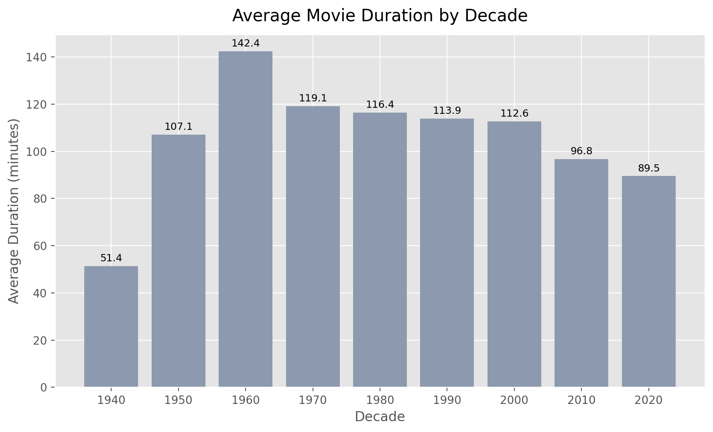
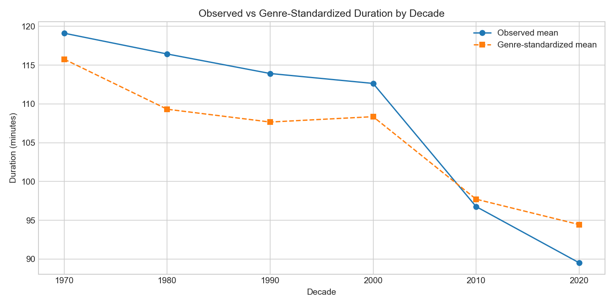

# Investigating Netflix Movie Runtime Patterns

This project is now structured as a notebook-first investigation report rather than a lightweight chart exercise. The central question is:

**Are Netflix movies actually getting shorter over time, or is that pattern partly explained by changes in catalog composition?**

The full analysis is performed in:

- `Investigating_Netflix_Movies.ipynb`

## Investigation Flow

The notebook is organized as an evidence-building EDA:

1. establish dataset reliability and scope
2. isolate the movie-only population
3. inspect catalog composition and temporal exposure
4. analyze duration distributions and time trends
5. test confounders such as genre mix and country concentration
6. add a deeper inference layer for uncertainty-aware conclusions

## Methods Used

- descriptive exploratory data analysis
- weighted runtime trend estimation
- Spearman rank correlation
- bootstrap confidence intervals for decade means
- genre-standardized decade comparison
- country-level slope comparison
- quantile trend tracking

## Current Headline Findings

- Total titles in dataset: `7,787`
- Movies analyzed: `5,377`
- Weighted full-sample slope: `-1.2801` minutes per year
- Post-2000 weighted slope: `-1.2947` minutes per year
- Spearman correlation between release year and duration: `-0.2105`
- Modern decades are shorter on average than the 1990s and 2000s
- Genre mix and country mix explain part of the decline, but not all of it

## Main Verdict

The updated notebook supports a stronger conclusion than the old version:

- movie runtimes do trend shorter in the modern Netflix catalog
- the decline is moderate rather than dramatic
- composition effects matter, especially genre and country concentration
- the pattern is real, but it is not well described by a simple yes/no shortcut

## Project Structure

```text
investigating-netflix-movies/
├── Investigating_Netflix_Movies.ipynb
├── netflix_data.csv
├── README.md
├── requirements.txt
├── .gitignore
└── plots/
    ├── average_duration_by_decade.png
    ├── content_type_split.png
    ├── deep_analysis_report.txt
    ├── deep_country_trend_slopes.png
    ├── deep_decade_bootstrap_ci.png
    ├── deep_genre_standardized_trend.png
    ├── deep_quantile_trends.png
    ├── duration_distribution.png
    ├── movie_duration_by_year.png
    ├── movies_by_release_year.png
    ├── top_countries.png
    └── top_genres.png
```

## Plot Output Guide

Baseline EDA plots:

- `content_type_split.png`
- `movies_by_release_year.png`
- `duration_distribution.png`
- `movie_duration_by_year.png`
- `average_duration_by_decade.png`
- `top_genres.png`
- `top_countries.png`

Deep-dive outputs:

- `deep_decade_bootstrap_ci.png`
- `deep_genre_standardized_trend.png`
- `deep_country_trend_slopes.png`
- `deep_quantile_trends.png`
- `deep_analysis_report.txt`

## Visual Snapshot

### Runtime Trend by Release Year


### Average Duration by Decade



### Deep Genre-Standardized Comparison



## Running the Project

```bash
pip install -r requirements.txt
jupyter notebook Investigating_Netflix_Movies.ipynb
```

Run the notebook from top to bottom to reproduce the full investigation and regenerate the figures saved in `plots/`.
