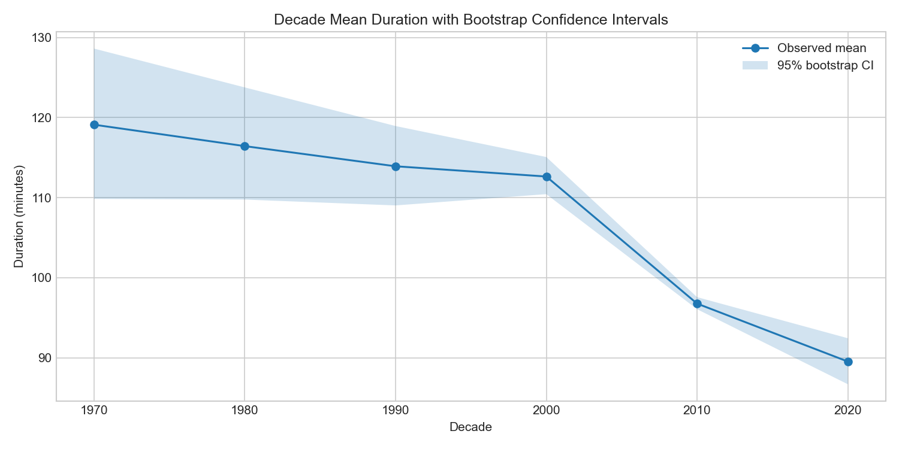
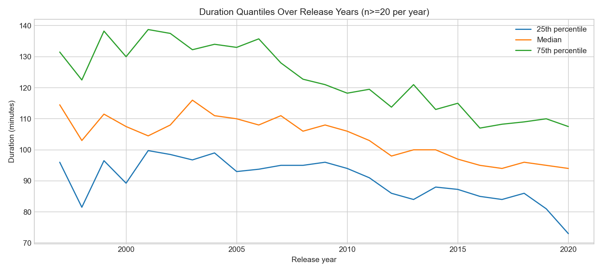

# Investigating Netflix Movie Runtime Patterns

This project is a notebook-first investigation of a single question:

**Are Netflix movies really getting shorter over time, or is the trend partly explained by changes in catalog composition?**

The full analysis lives in [Investigating_Netflix_Movies.ipynb](Investigating_Netflix_Movies.ipynb). It is written as a continuous investigation, not as a pile of disconnected charts.

## Investigation Brief

Primary hypothesis:

- newer Netflix movie releases trend shorter in runtime

Alternative explanations tested in the notebook:

- the observed decline is partly a genre-composition effect
- country concentration changes create part of the movement
- sparse early decades exaggerate apparent long-run trend strength

## What The Notebook Shows

The notebook moves through the problem in stages:

1. check data reliability and missingness
2. isolate movies from TV shows
3. inspect runtime patterns across years and decades
4. test confounders from genre and country mix
5. add deeper statistical checks before giving a final verdict

## Key Evidence

- Total titles in the dataset: `7,787`
- Movies analyzed after cleaning: `5,377`
- Stable-year weighted runtime trend: about `-1.28` minutes per year
- Post-2000 weighted runtime trend: about `-1.29` minutes per year
- Spearman correlation between release year and duration: `-0.2105`
- Mean runtime fell from `113.92` minutes in the 1990s to `96.76` in the 2010s and `89.52` in the 2020s

## Final Verdict

The notebook supports a more careful conclusion than a simple yes/no answer:

1. Netflix movie runtimes do trend shorter in the modern catalog.
2. The decline is moderate, noisy, and period-dependent rather than a dramatic collapse.
3. Genre and country mix explain a meaningful share of the observed shift.
4. Even after adjustment, a downward runtime pattern still remains.

The strongest takeaway is this:

**Netflix runtime evolution is best understood as a blend of time effects and catalog-composition effects, not as a single-factor story.**

## Methods Used

- descriptive exploratory data analysis
- weighted runtime trend estimation
- Spearman rank correlation
- bootstrap confidence intervals for decade means
- genre-standardized decade comparison
- country-level slope comparison
- quantile trend tracking

## Project Structure

```text
investigating-netflix-movies/
├── Investigating_Netflix_Movies.ipynb
├── netflix_data.csv
├── README.md
├── requirements.txt
├── .gitignore
└── plots/
    ├── average_duration_by_decade.png
    ├── content_type_split.png
    ├── deep_analysis_report.txt
    ├── deep_country_trend_slopes.png
    ├── deep_decade_bootstrap_ci.png
    ├── deep_genre_standardized_trend.png
    ├── deep_quantile_trends.png
    ├── duration_distribution.png
    ├── movie_duration_by_year.png
    ├── movies_by_release_year.png
    ├── top_countries.png
    └── top_genres.png
```

## Plot Outputs

The `plots/` folder contains the saved notebook outputs. The baseline charts cover content mix, runtime distribution, and year/decade trends. The deep-analysis charts cover bootstrap intervals, genre-standardized trends, country slope heterogeneity, and quantile movement.

## Visual Snapshot






## Running The Project

```bash
pip install -r requirements.txt
jupyter notebook Investigating_Netflix_Movies.ipynb
```

Run the notebook from top to bottom to reproduce the analysis and regenerate the figures in `plots/`.
